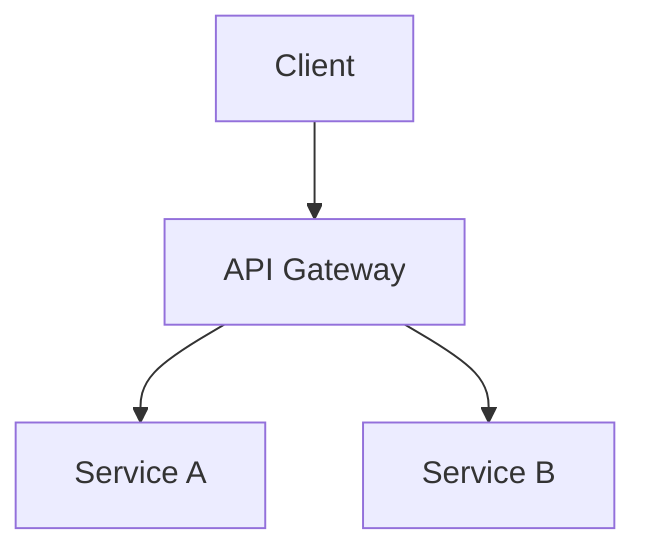

# Architecture Diagram Skill

## When to use
- User asks to design a new system or feature
- Need to document existing architecture
- Reviewing scalability or reliability concerns

## Process

### 1. Understand requirements
- Functional requirements (what the system does)
- Non-functional requirements (scale, latency, availability)
- Constraints (budget, team size, existing infra)

### 2. Identify components
- Frontend, backend, data stores, external services
- Communication patterns (sync/async, streaming/batch)
- Data flow (ingest → process → store → serve)

### 3. Diagram
- Use Mermaid or ASCII diagrams in markdown
- Label each component with its responsibility
- Show data flow with arrows
- Highlight critical paths

### 4. Risk assessment
- Single points of failure
- Bottlenecks (hot paths, shared resources)
- Security boundaries
- Blast radius of failures

## Output format
```markdown
## Architecture: {System Name}



### Components
| Component | Responsibility | Scale |
|-----------|---------------|-------|
| ... | ... | ... |

### Risks
1. ...
2. ...

### Recommendations
1. ...
2. ...
```
